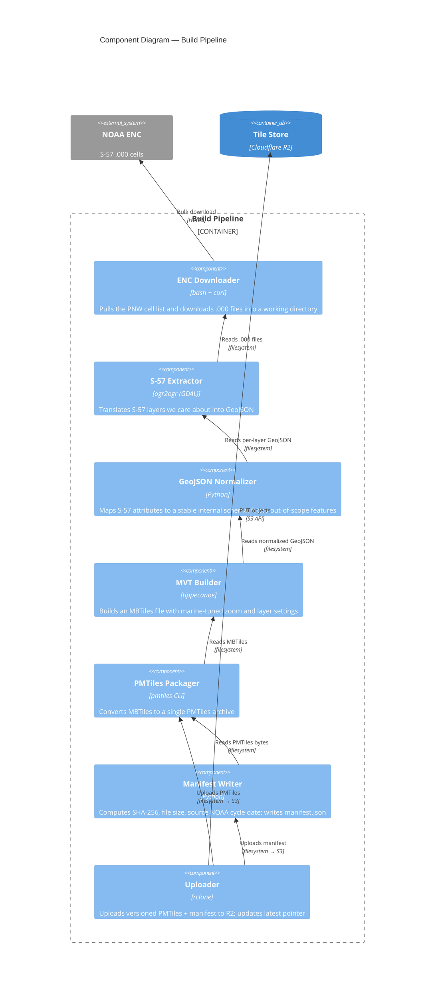
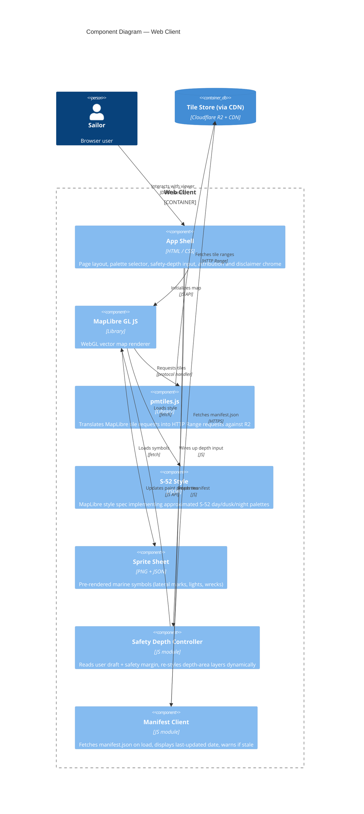

# Components (C4 Level 3)

This view zooms into the two containers with non-trivial internal structure: the **Build Pipeline** and the **Web Client**. The other containers (Tile Store, CDN, Onboard Server) are off-the-shelf and have no useful component decomposition.

## Build Pipeline components

### Build Pipeline component catalog

| Component | Responsibility | Owns these decisions |
| --- | --- | --- |
| **ENC Downloader** | Fetch the PNW cell list from NOAA's bulk endpoint. Resumable, retry-on-failure, integrity-check via NOAA's published MD5s. | What cells are in scope (driven by a bounding-box config file in `pipeline/regions/pnw.yaml`). |
| **S-57 Extractor** | Run `ogr2ogr` per cell per layer with GDAL's S-57 driver. Emit one GeoJSON file per (cell, layer) pair. | The S-57 layer subset we care about (`DEPARE`, `SOUNDG`, `BOYLAT`, etc.). |
| **GeoJSON Normalizer** | Map S-57 attribute codes to a stable internal schema; drop features below a relevance threshold; merge per-cell GeoJSONs into per-layer GeoJSONs. | Attribute mapping (`OBJNAM` → `name`, `VALDCO` → `depth_m`, etc.) and feature filtering rules. |
| **MVT Builder** | Run `tippecanoe` with marine-tuned arguments (`--no-tile-stats`, per-layer minzoom/maxzoom, layer-specific feature limits). | Tile size budget, zoom-level cutoffs, generalization strategy. |
| **PMTiles Packager** | Run `pmtiles convert` to produce a single archive. | Whether to split by region (PNW vs. all-US) — currently single-file. |
| **Manifest Writer** | Compute file metadata; write `manifest.json` with version, timestamp, source NOAA cycle date, file size, SHA-256, schema version. | The manifest schema, which is the public contract for clients. |
| **Uploader** | Push the versioned PMTiles and updated manifest to R2; update the `latest` pointer atomically. | Naming convention for versioned objects; concurrency safety of the pointer swap. |

Each component is invokable independently. The whole pipeline is orchestrated by a single `pipeline/build.sh` that runs them in sequence; CI calls the same script.

## Web Client components

### Web Client component catalog

| Component | Responsibility | Notes |
| --- | --- | --- |
| **App Shell** | Page skeleton, palette selector, safety-depth input, disclaimer banner. | Plain HTML + CSS; no framework. ~200 lines. |
| **MapLibre GL JS** | Vector map rendering, viewport management, paint computation. | Off-the-shelf. Version pinned in `web/package.json`. |
| **pmtiles.js** | Registers a `pmtiles://` protocol handler so MapLibre tile requests become byte-range fetches against a remote PMTiles file. | This is the trick that makes the "no tile server" architecture work in the browser. |
| **S-52 Style** | MapLibre style JSON describing layer order, paint, filter expressions, and per-zoom visibility for each marine feature. | The biggest single asset we author. Living document; expect dozens of iterations. |
| **Sprite Sheet** | Pre-rendered raster symbols for lateral marks, cardinal marks, lights, wrecks, anchorages. | Built from open-source S-52 symbol sets where licensing permits; otherwise hand-drawn. |
| **Safety Depth Controller** | Reads the user's draft + safety margin, updates MapLibre paint expressions at runtime to highlight contours and shade "shallower than safe" areas. | Pure client-side computation. No server round-trip. |
| **Manifest Client** | Fetches `manifest.json` at app load; surfaces the "charts last updated" date and shows a warning if older than the threshold from [risks-and-safety.md](../risks-and-safety.md). | The user-visible representation of freshness. |

## Why this decomposition

Each component on both sides has a single, narrow responsibility. That matters more in the pipeline than in the client because the pipeline is the place where bugs cause silent data corruption that ships to users — having clear, individually-testable steps means a bad weekly build can be diagnosed and rolled back component-by-component.

The client decomposition is lighter on purpose: a static viewer doesn't need component boundaries policed the same way. The split into modules is for readability and for future swap-ability (e.g. swapping `pmtiles.js` for a different transport when PMTiles v4 changes).
