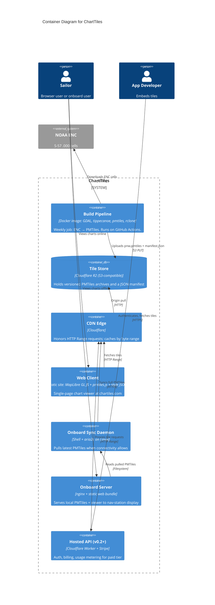

# Containers (C4 Level 2)

A "container" in C4 terms is an independently deployable runtime or data store. This view shows the seven that make up ChartTiles end to end.

## Diagram

## Container catalog

### Build Pipeline

- **Runtime:** Docker image, runs on GitHub Actions on a weekly schedule.
- **Inputs:** NOAA ENC bulk endpoint.
- **Outputs:** `pnw.pmtiles` + `manifest.json` uploaded to the Tile Store.
- **Stateless.** Each run is fully reproducible from a pinned commit + a pinned NOAA snapshot date.
- **Single failure mode:** if NOAA's endpoint changes shape, the pipeline fails fast and pages the maintainer. Last-known-good PMTiles remains served from the Tile Store.

### Tile Store (Cloudflare R2)

- **Stores:** versioned PMTiles (`pnw-2026-07-15.pmtiles`), a `latest` pointer (`pnw.pmtiles` → most recent), and a JSON manifest with version, build timestamp, source NOAA cycle, file size, and SHA-256.
- **Access pattern:** writes once per week by the pipeline, reads at high rate by the CDN.
- **Why R2:** zero egress fees, S3-compatible API. Substitutable with any S3-compatible store.

### CDN Edge (Cloudflare)

- Fronts the Tile Store.
- Honors `Range:` headers — this is the load-bearing capability for PMTiles delivery.
- Caches by `(URL, byte range)`. Hit rates are very high because individual tiles are addressed by stable byte ranges within a versioned file.

### Web Client

- **Runtime:** static HTML/CSS/JS, no framework, served from GitHub Pages or Cloudflare Pages.
- **Dependencies:** MapLibre GL JS, `pmtiles.js`, our style JSON.
- **State:** local-only — selected palette (day/dusk/night), current viewport, safety-depth setting. Nothing posted back.

### Onboard Sync Daemon

- **Runtime:** a shell script + `aria2c` running on the onboard Linux box.
- **Triggers:** cron (every 6 hours) plus a manual "sync now" button in the local viewer.
- **Behavior:** fetches the manifest, compares versions, downloads the newer PMTiles with resumable HTTPS, atomically replaces the local file, signals nginx to flush its open file handles.
- **Bandwidth-aware:** configurable cap (default 1 Mbit/s) so it doesn't saturate marina wifi or LTE.

### Onboard Server

- **Runtime:** nginx in a Docker Compose stack on the onboard box.
- **Serves:** local PMTiles (via a small nginx config that honors `Range`), the static web bundle, and a local copy of the style JSON.
- **Access:** any device on the boat's wifi can point a browser at `http://chartiles.local:8080`.

### Hosted API (v0.2+)

- Deferred until adoption signal exists.
- A Cloudflare Worker handles auth (API keys), rate limiting, usage metering, and Stripe billing webhook handling.
- Proxies tile requests to the same CDN-backed Tile Store; does not duplicate the data.

## Container-level decisions

- **No queue.** The build runs on a schedule; there's no async backplane. If a build fails, the next scheduled run retries it.
- **No database at runtime.** R2 + a JSON manifest is the entire state of the system. See [ADR-0005](../adr/0005-static-file-serving-no-gis-database.md).
- **No tile server process.** PMTiles' design intent is "skip the tile server" — clients read directly from object storage. See [ADR-0003](../adr/0003-pmtiles-over-btrfs.md).
- **The onboard runtime is intentionally tiny.** Two containers (nginx + the sync script as a thin wrapper) so it can run on a $35 Pi with 4 GB RAM.
