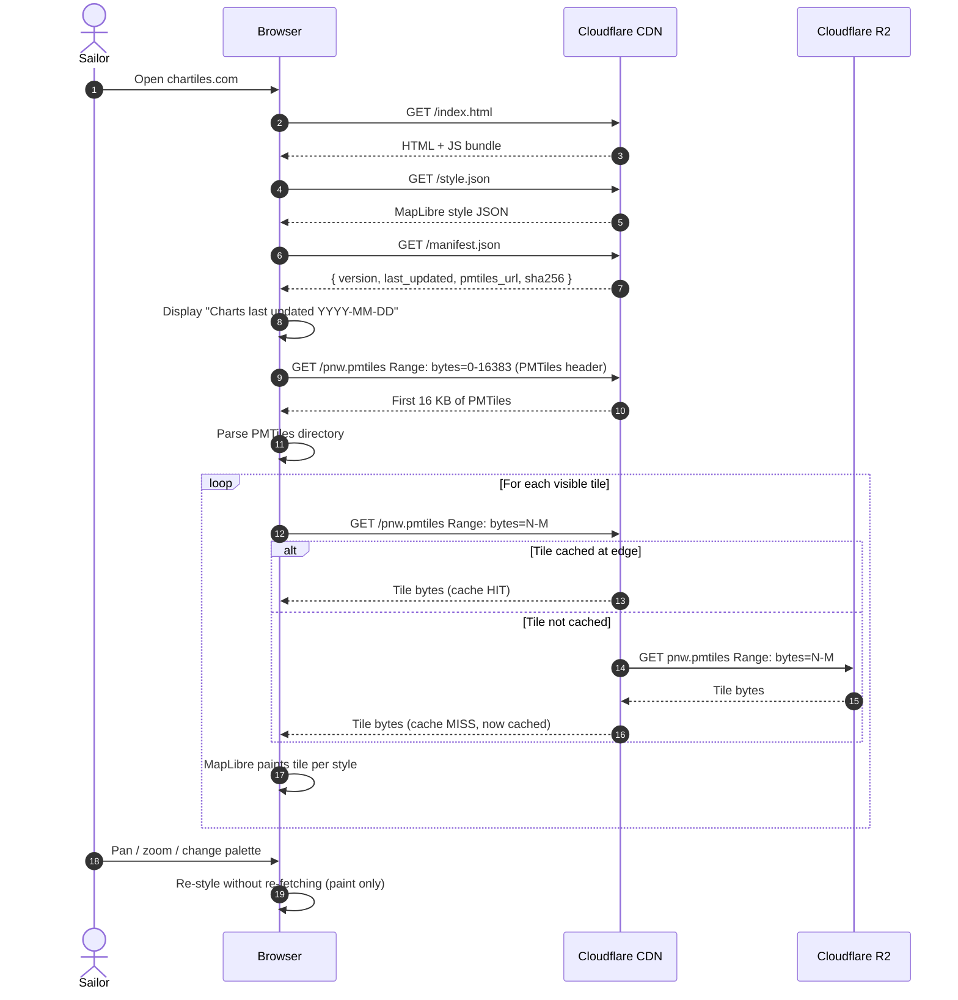

# Data Flows (Dynamic View)

Sequence diagrams for the three flows that matter end to end: the weekly build, the browser viewing path, and the onboard sync path.

## Weekly build and publish

```mermaid
sequenceDiagram
    autonumber
    participant Cron as GitHub Actions (cron)
    participant Pipeline as Build Pipeline
    participant NOAA
    participant R2 as Cloudflare R2
    participant CDN as Cloudflare CDN

    Cron->>Pipeline: Trigger weekly build
    Pipeline->>NOAA: GET cell list for PNW bounding box
    NOAA-->>Pipeline: List of .000 cells
    loop For each cell
        Pipeline->>NOAA: GET cell.000 (with MD5 check)
        NOAA-->>Pipeline: cell.000 bytes
    end
    Pipeline->>Pipeline: ogr2ogr extract layers → GeoJSON
    Pipeline->>Pipeline: Normalize attributes, filter features
    Pipeline->>Pipeline: tippecanoe build MVT → MBTiles
    Pipeline->>Pipeline: pmtiles convert → pnw-YYYY-MM-DD.pmtiles
    Pipeline->>Pipeline: Compute SHA-256, write manifest.json
    Pipeline->>R2: PUT pnw-YYYY-MM-DD.pmtiles
    Pipeline->>R2: PUT manifest.json
    Pipeline->>R2: Update latest pointer (pnw.pmtiles → versioned object)
    Pipeline->>CDN: Purge manifest.json cache
    Note over CDN: Versioned PMTiles cached indefinitely; only manifest needs purge
    Pipeline->>Cron: Report success (or fail loudly)
```

**Cadence:** Weekly, aligned with NOAA Notice to Mariners. Configurable to daily later if NOAA's update rate justifies it.

**Failure handling:** If any step fails, the run aborts and the previous successful PMTiles remains the `latest`. The maintainer is notified via GitHub Actions failure email. There is no auto-retry on data errors (failing loud is preferred to silent corruption).

**Idempotency:** Two runs against the same NOAA snapshot date produce byte-identical PMTiles. This is testable in CI.

## Browser viewing path



**Latency profile:** First viewport: ~3–5 round trips for HTML + JS + style + manifest + PMTiles header, then parallel tile fetches. After cache warm-up, panning is bandwidth-bound by tile size (~10–50 KB per tile).

**Why no tile server:** All decoding happens in the browser. The CDN sees only HTTP `Range` requests, which it caches by `(URL, byte range)`. No server-side decoding, no per-user state.

## Onboard sync path

```mermaid
sequenceDiagram
    autonumber
    participant Cron as Local cron
    participant Sync as Onboard Sync Daemon
    participant CDN as Cloudflare CDN
    participant Nginx as Onboard nginx
    participant Browser as Nav-station Browser

    Note over Cron,Browser: Every 6 hours, or on user request

    Cron->>Sync: Trigger sync check
    Sync->>CDN: GET /manifest.json
    CDN-->>Sync: { version: "2026-07-22", sha256: "..." }
    Sync->>Sync: Compare with local manifest

    alt No update
        Sync->>Cron: Exit 0, no work
    else Update available
        Sync->>CDN: HEAD /pnw-2026-07-22.pmtiles
        CDN-->>Sync: Content-Length, ETag
        Sync->>Sync: Check available disk space
        Sync->>CDN: GET /pnw-2026-07-22.pmtiles (aria2c, resumable, bandwidth-capped)
        CDN-->>Sync: PMTiles bytes (may span multiple resumed sessions)
        Sync->>Sync: Verify SHA-256 against manifest
        alt SHA mismatch
            Sync->>Sync: Discard, log failure, alert local UI
        else SHA matches
            Sync->>Sync: Atomic rename: pnw.pmtiles.new → pnw.pmtiles
            Sync->>Nginx: Reload (SIGHUP) to drop old file handles
        end
    end

    Note over Browser,Nginx: Independent of sync; runs whenever sailor opens viewer

    Browser->>Nginx: GET /pnw.pmtiles Range: bytes=N-M
    Nginx-->>Browser: Tile bytes (from local filesystem)
```

**Bandwidth model:** A weekly full download of `pnw.pmtiles` is on the order of hundreds of MB. Over LTE at marina rates that's ~5–15 minutes; over Starlink, ~1–2 minutes; over marina wifi, variable. The bandwidth cap defaults to 1 Mbit/s so the sync doesn't starve other boat-network traffic.

**Atomic swap:** The new PMTiles is downloaded as `pnw.pmtiles.new`, hashed, then `rename(2)`d over the old file. nginx is sent `SIGHUP` to force-close stale open file descriptors. The viewer never sees a partially-written file.

**Offline behavior:** If `manifest.json` is unreachable, the daemon logs and exits cleanly. The local PMTiles remains in service for as long as the sailor accepts its staleness — see the freshness warning in [risks-and-safety.md](../risks-and-safety.md).

## Update notification (deferred to v0.2+)

A subscription mechanism — push notification, RSS feed, or a `manifest.json` polled by the onboard daemon — that lets a boat know when new charts are available. v0.1 polls on a schedule. Push-based notification is a v0.2+ enhancement, not load-bearing.
