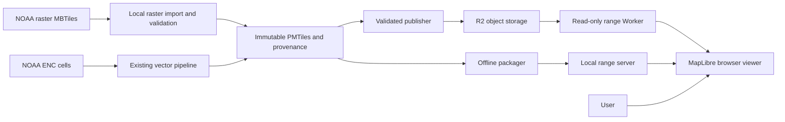

# Raster chart view architecture

Status: implemented locally under ADR 0009; production publication remains.
See [run instructions and measurements](../raster-chart-view.md).

## Context and containers

A user views pre-rendered charts or inspects extracted ENC features. NOAA supplies
the two inputs through separate distribution paths; matching dates and coverage
must not be assumed. The browser remains the only chart display runtime.

This is a container-level view of existing and planned responsibilities.
The raster importer is new; the publisher and packager support both artifacts.

## Browser components

The manifest adapter validates and normalizes old vector-only manifests and the
new versioned format. A mode controller selects Chart view or Inspect features,
preserves the camera and controls tools. MapLibre adapters create a raster source
or the existing vector layers. A source-status panel presents active provenance,
attribution, errors and scale limits. These are logical responsibilities; exact
module names should follow implementation needs.

Source validation and manifest selection are independent of MapLibre. MapLibre
and the HTTP adapters handle rendering and retrieval. Raster images retain their
upstream portrayal; no client-side S-52 engine is introduced.

## Publication and offline consistency

Validate artifacts, upload immutable objects, then replace the small manifest.
Keep the prior manifest for rollback. A reader must obtain a complete release
from one manifest, even during publication. Retain existing referenced archives;
cleanup is a separate operation.

Offline packaging copies the selected artifacts and rewrites their URLs to local
paths. The optional coverage audit references the vector archive only. Raster
availability and coverage are separate metadata and UI concerns.

## Compatibility and limitations

Vector-only manifests remain supported. Failed raster requests produce a visible
error and an explicit route to inspection. Raster mode never identifies hidden
vector features, and does not reuse vector coverage as a raster coverage claim.
Native raster zoom limits control overzoom messaging. Publication dates may be
unknown and must be distinguished from download dates.

See [ADR 0009](../adr/0009-raster-chart-view-with-vector-inspection.md) and the
[work plan](../raster-chart-plan.md) for scope and acceptance criteria.
