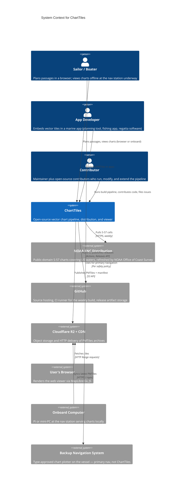

# System Context (C4 Level 1)

The widest view: who uses ChartTiles, what it does, and which external systems it depends on.

## Diagram

## Actors

**Sailor / Boater** — The primary end user. Two modes of use: planning (in a browser, at a marina with wifi, the day before a passage) and underway (at the nav station, offline, on the onboard rig). The same chart, the same viewer, the same data — different transport.

**App Developer** — Builds marine apps and wants vector chart data without standing up their own NOAA ingestion pipeline. Uses either the downloadable PMTiles directly (`pnw.pmtiles`) or, once available, the hosted endpoint at `data.chartiles.com`.

**Contributor** — The maintainer and the eventual open-source contributor community. Reads the [implementation plan](../implementation-plan.md), opens issues, sends PRs, runs the build locally to verify changes.

## External systems

**NOAA ENC Distribution** — The upstream source of all chart data. NOAA publishes S-57 cells via a [bulk download endpoint](https://charts.noaa.gov/ENCs/ENCs.shtml) refreshed on Notice to Mariners cycles. Public domain. The single most important external dependency; the project's entire data supply chain originates here.

**GitHub** — Source repository, CI runner via GitHub Actions, and release artifact host for the weekly PMTiles build. The build is fully reproducible in CI; nothing runs on the maintainer's laptop.

**Cloudflare R2 + CDN** — Object storage for PMTiles archives plus Cloudflare's global CDN for low-latency `Range` request serving. Chosen for zero egress fees and S3-compatible API. Substitutable with any S3-compatible store plus any CDN that honors `Range` headers.

**User's Browser** — A modern browser running MapLibre GL JS, `pmtiles.js`, and our style JSON. No backend involved in the viewing path.

**Onboard Computer** — A Raspberry Pi 5 or Intel N100 mini-PC at the nav station. Runs nginx + the static web bundle + a sync script. May be offline for days or weeks at a time.

**Backup Navigation System** — Explicitly noted in this diagram because ChartTiles' safety posture (see [risks-and-safety.md](../risks-and-safety.md)) requires its existence. Type-approved chart plotters from Garmin, B&G, Raymarine, Furuno, etc. ChartTiles is reference and planning software, not a replacement for these.

## What ChartTiles is responsible for

- Ingesting raw NOAA ENC data on a weekly cadence.
- Translating it to a modern vector tile format (PMTiles).
- Hosting the result in a way that's cheap, cacheable, and offline-capable.
- Providing a reference web client and onboard configuration.
- Defining a stylesheet that approximates S-52 well enough to be usable for planning.

## What ChartTiles is not responsible for

- Real-time data (AIS, weather, currents).
- Routing or passage planning logic.
- Acting as a primary nav aid.
- Hosting derivative chart data (other hydrographic offices, custom overlays). These are deferred to v2.0+.
