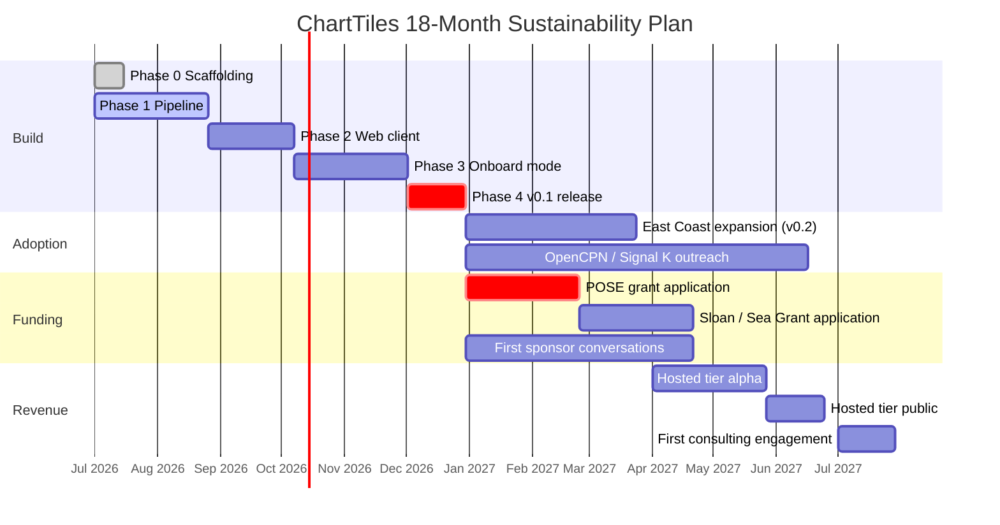

# Roadmap

This is the 18-month sustainability plan. The [implementation plan](implementation-plan.md) covers what gets built; this covers how the project pays for itself.

## Thesis

ChartTiles is open-source infrastructure. The financial model is the same one that sustains Protomaps, the broader OpenStreetMap ecosystem, and most successful single-maintainer geospatial OSS projects:

1. **Grants** carry the project across the first two years.
2. **A hosted tier** generates recurring revenue once a meaningful open-source user base exists.
3. **Bespoke consulting engagements** convert credibility into lumpy, high-margin contracts.
4. **Sponsorships** are a credibility signal more than a revenue line.

Target steady-state at month 24: **$120–180K gross annual revenue**, split roughly 50% grants / 25% hosted / 20% consulting / 5% sponsorships. This is enough for the maintainer to go part-time on the project; it is not venture-scale and is not trying to be.

## Timeline

## Funding strategy

### Tier 1 — Grants (the load-bearing revenue line)

| Source | Range | Best for | Notes |
| --- | --- | --- | --- |
| **NSF POSE** (Pathways to Enable Open-Source Ecosystems) | $300K–$1.5M | The main bet | Phase I is $300K / 2 years. Strong fit: open infra, public-benefit data, broad community use case. Annual call. |
| **NOAA Sea Grant** | $25–75K | First grant to land | Smaller but credibility-building. NOAA is the upstream data source, so the narrative writes itself. |
| **Sloan Foundation** — Better Software for Science | $250K+ | Backup to POSE | Funds open scientific infrastructure. Less of a slam-dunk than POSE but in the same shape. |
| **Sovereign Tech Fund** (Germany) | €50–500K | If POSE / Sloan miss | Funds open infra of public benefit. Has explicitly funded geospatial. Politically sensitive to non-EU recipients but not blocked. |
| **NLnet** | €5–50K | Stopgap | Smaller, faster turnaround, writer-friendly application process. |

**Workload realism:** A serious POSE application is ~80 hours of writing. A Sloan letter of inquiry is ~20 hours. NLnet is closer to 8 hours. Budget grant-writing time as if it were a project phase.

### Tier 2 — Hosted tier (`data.chartiles.com`)

The hosted tier exists to serve the "I don't want to self-host" cohort downstream of the open-source project. It's not competing with Mapbox; it's an easy button for people already using ChartTiles.

**Positioning:** "Hosted PMTiles for marine apps, $X/month, NOAA charts updated weekly, no API key gymnastics."

**Pricing brackets (placeholder, refine after first 5 customers):**

- Free: 10K tile loads/month, attribution required.
- Indie: $19/month, 250K loads/month, no attribution required.
- Studio: $99/month, 2M loads/month, custom subdomain.
- Custom: contract, typically $500–2,000/month for marine app companies with real volume.

**Infrastructure:** Cloudflare R2 + Cloudflare Workers + Stripe. Estimated COGS at $30K ARR: ~$300/month. Margins are healthy because the underlying data is static and CDN-cacheable.

**Realistic ARR ceiling within 18 months:** $30–80K. This is a side income, not a salary.

### Tier 3 — Consulting

Inbound, not outbound. Likely shapes:

- **National hydrographic offices** modernizing their chart distribution (Canada CHS, UK UKHO, NZ LINZ, AU AHO). $40–100K per engagement, 1–2 per year if any.
- **Charter fleet operators** wanting offline charts on every boat. $20–40K per engagement.
- **Marine app companies** wanting a custom pipeline for a niche chart subset. $10–25K per engagement.

**Operating model:** No more than two engagements concurrent. Consulting subsidizes open-source, not the other way around.

### Tier 4 — Sponsorships

Realistic targets, in order of fit:

- **Cloudflare** — Project Galileo / Workers for OSS — likely free infrastructure rather than cash.
- **GitHub** — Accelerator program — $40K + mentorship for ~12 weeks.
- **NMEA / RTCM** — marine industry standards bodies; small ($1–5K) but credibility-building.
- **Boatbuilders** (Beneteau, Catalina, J/Boats, Boréal) — long-shot, but the cruising-community goodwill angle is real.
- **Tidelift** — only if the project becomes a transitive dependency of commercial software.

## Decision gates

| Month | Decision |
| --- | --- |
| **Month 6** | v0.1 shipped? If no, freeze new features and finish v0.1 before doing anything else. |
| **Month 12** | At least one grant moved to a next round OR at least 3 paying hosted-tier customers? If no, the OSS infra direction is not financially viable as primary work — re-evaluate whether ChartTiles is a side project or whether to pivot toward Fork 2 (cruiser appliance). |
| **Month 18** | $80K+ annualized revenue across all four tiers? If yes, maintainer goes part-time on the project. If no, project continues as nights-and-weekends with realistic expectations. |

## What this roadmap deliberately does not promise

- A specific user count.
- A specific funding amount.
- Anything that depends on a venture round.
- A path to acquisition.

Adoption metrics and revenue numbers above are targets, not commitments. The grant funding ecosystem in particular is high-variance and slow; budgeting on it assuming a 100% hit rate is how open-source projects burn out.
